# 개요
본 프로젝트는 자동차 대여관리 서비스를 모델로 하여 관리자 입장에서 사용할 프로그램을 구현하는데 목표를 두었다.
***
# 프로그램 설명서
### 로그인
* 데이터베이스에 저장된 ID와 비밀번호로 로그인 인증을 한다.
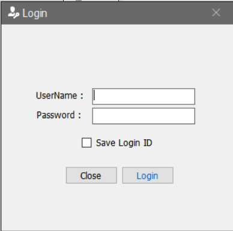

### 메인화면

* 로그인 성공 직후의 화면이다. 

* 제목 표시줄에 로그인한 사용자의 ID가 나타나도록 했다. 

* Image Slider기능을 사용해서 다수의 이미지가 반복적으로 나타나도록 했다.

###### 리본버튼
* 프로그램 상단의 버튼으로 원하는 작업 페이지로 이동할 수 있다.
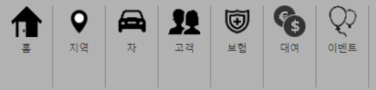

### 관리화면
* 리본버튼을 클릭하거나 좌측 하단의 네비게이션 바를 클릭하여 관리 관리 페이지를 이동할 수 있다.
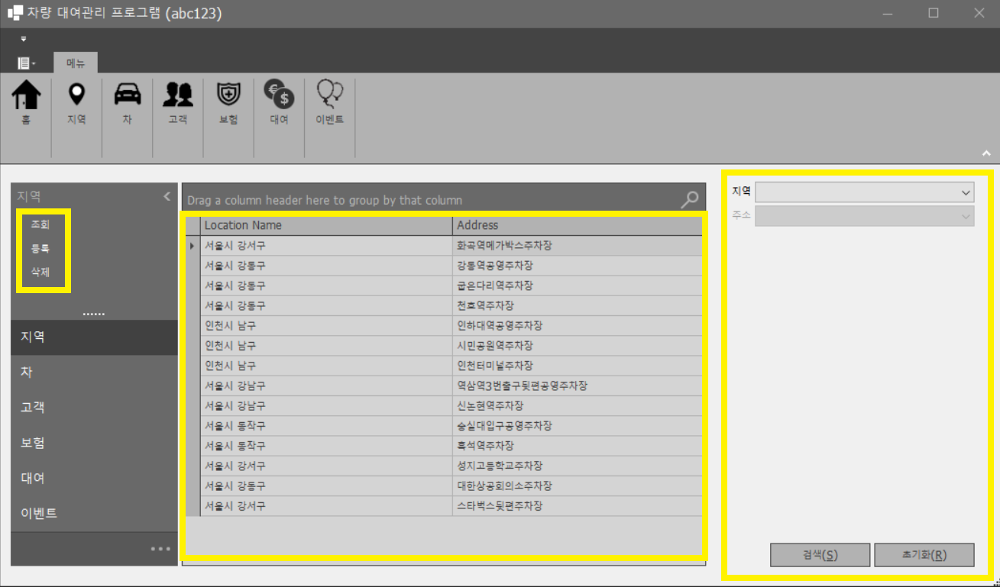

* 좌측 상세메뉴에서 조회를 클릭하면 중앙의 Grid View에서 전체 내역을 불러오고 우측 검색창이 활성화된다.

* 등록을 클릭하면 새 창이 열리고 입력사항을 데이터베이스에 등록한다.
 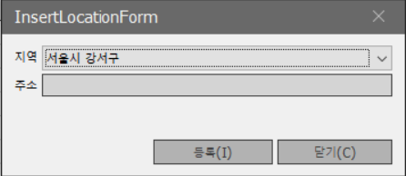

* Grid View에서 원하는 항목을 더블클릭하면 수정할 수 있다.
 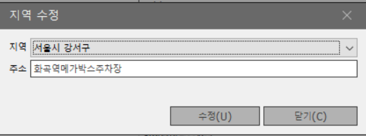

* 좌측 상세메뉴에서 삭제를 클릭하면 검색창 대신 삭제 버튼이 활성화된다.

* 삭제할 항목을 선택하고 삭제버튼을 누르면 재확인을 거쳐 삭제가 이루어 진다.
 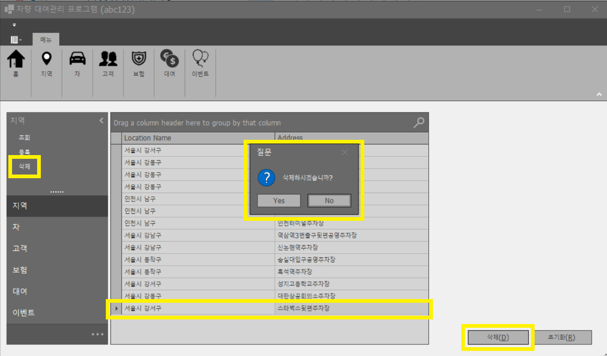

* 6개의 관리항목(지역, 차, 고객, 보험, 대여, 이벤트)에 대하여 조회, 검색, 등록, 수정, 삭제 기능을 제공한다.

***
# 관리항목
### 지역

### 차

### 고객

### 보험

### 대여

### 이벤트

# 사용기술
### 언어
* C# 3.0+
### 프레임워크
* .NET FRAMEWORK 4.8
* Entity Framework 6.2
* WINFORM
### 데이터베이스
* MSSQL Server 2019
### Third Party Control
* DevExpress
***

### 데이터베이스 스키마
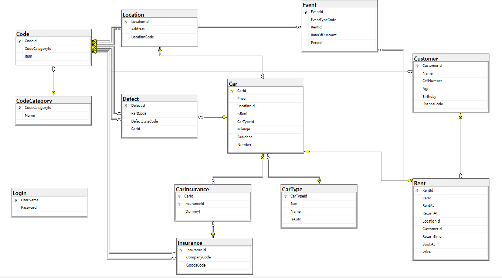

* 코드성 테이블이 많아서 코드카테고리 테이블과 
코드 테이블을 만들었고 그 결과 불필요한 테이블을 최소화했다.

* Car 테이블과 Insurance 테이블이 다:다 관계를 가진다.

* Visual Studio에서 테이블에 외래키만 가지고 있으면 
ADO.NET에 포함되지않아서 임의로 dummy속성을 테이블에 추가한다

***
# Point Of Interest
 ## Form의 삭제이벤트가 발생하지 않는 문제

### 증상
* DATA 삭제를 위해 삭제버튼을 눌렀을 때 오류 발생
### 원인
* DB 테이블 간 관계에서 연쇄삭제가 설정되어있지 않아 삭제 이벤트의 정상적인 수행불가
### 해결
* DB 테이블 간 관계속성에서 연쇄삭제 기능을 추가했다.
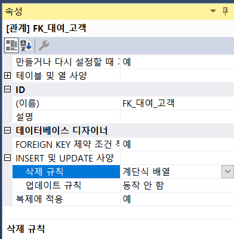     

   
   
## 유저컨트롤 간 상호작용

* 유저컨트롤 인스턴스에서 발생할 이벤트를 등록하고 이벤트 발생 시 메인폼에서 이벤트를 받도록 했다.
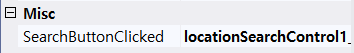

* 메인폼에서 전달받은 이벤트에는 Event Argument를 포함하고 있고,
이 Argument를 다른 User Control의 메서드로 넘겨 줌으로써 UserControl간 상호작용을 할 수 있었다.
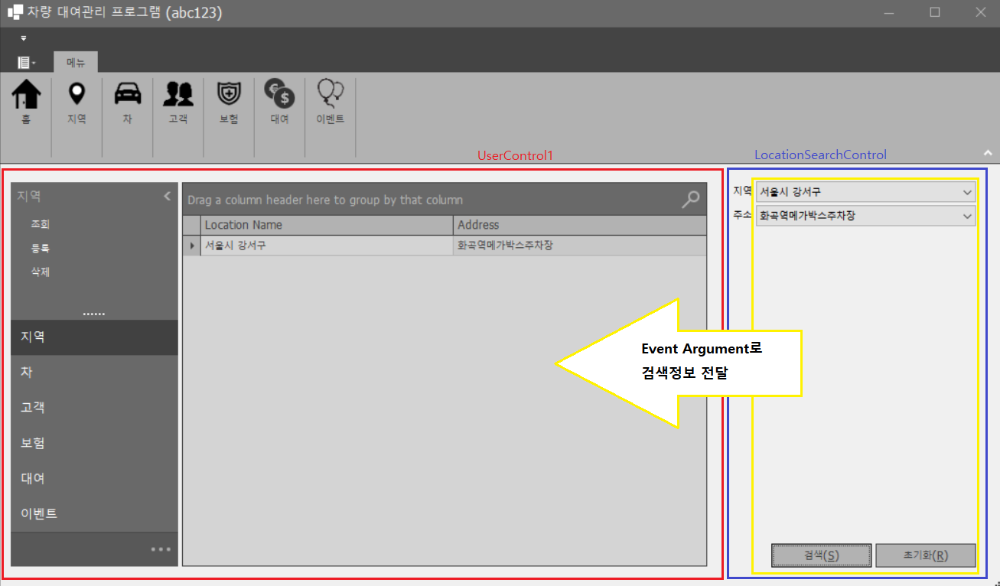

* 메인 폼에서 유저컨트롤의 필드에 접근할 수 없어서 메서드를 매개로 연결하였다.
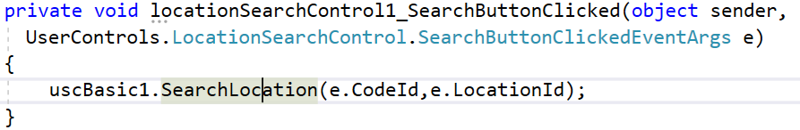

* 유저컨트롤의 design.cs파일에서 필드의 접근 지정자는 기본적으로 private인데 public 또는 internal로 수정하여 
메인폼에서 직접적으로 해당 필드를 사용할 수 있었다.
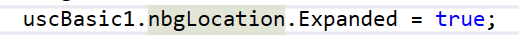

## 다수의 유저컨트롤 사용

* 6개 테이블(고객, 자동차, 대여, 지점, 이벤트, 보험)을 조회하기 위해 각기 다른 검색항목을 사용해야 했다. 
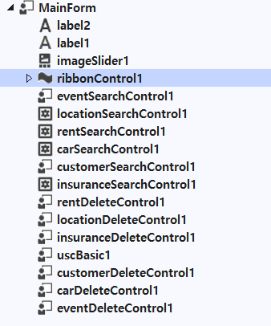

* 검색항목을 담은 유저컨트롤을 만들어서 원하는 때에만 Enable속성과 Visible 속성을 true로 하여 원하는 기능을 구현했다.
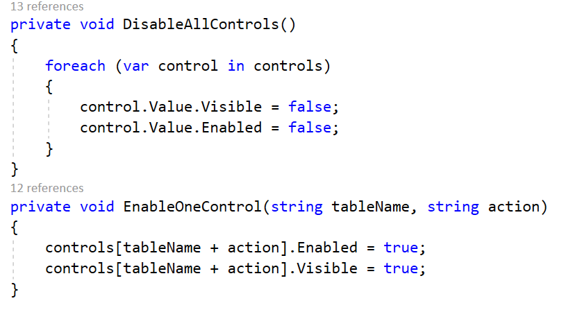
